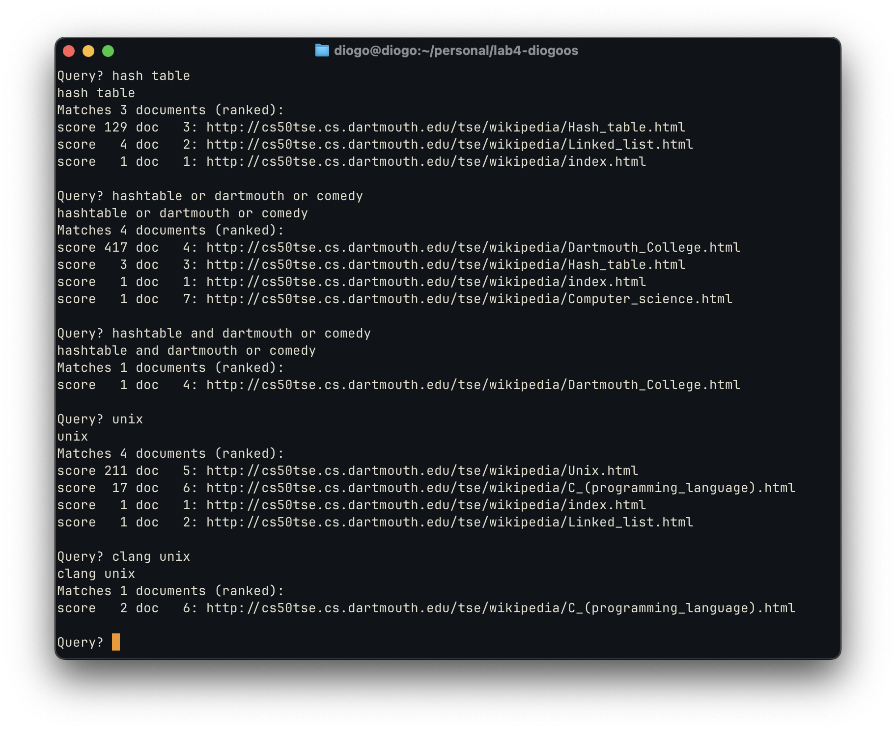
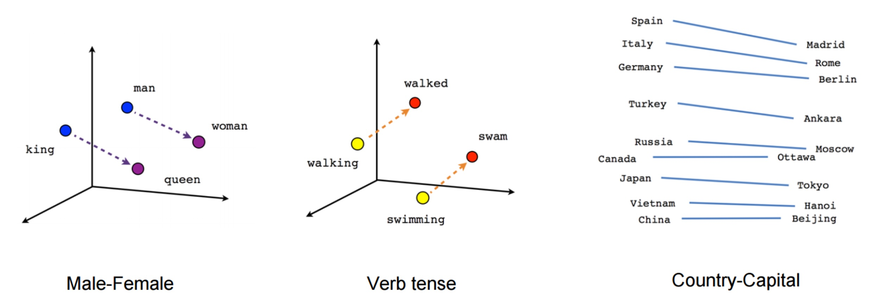
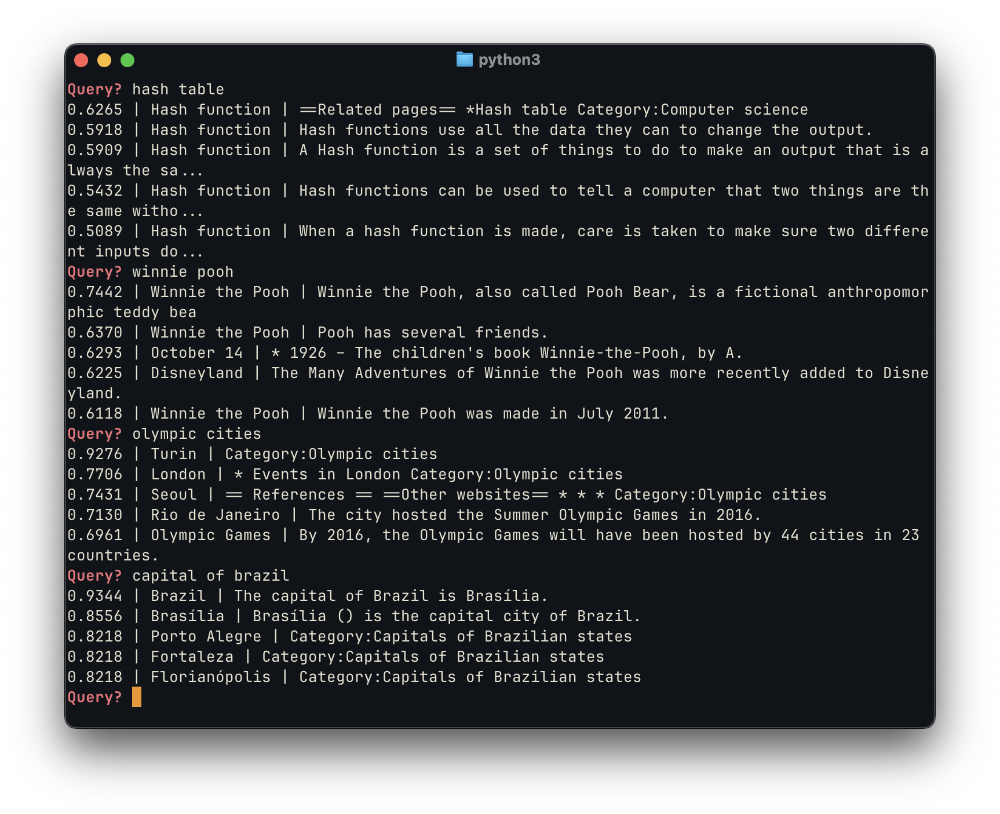

Search kind of sucks nowadays.
Even a simple query likely yields pages of "slop" content that hijacks SEO in order
to suck-in traffic and steal advertising dollars.  The situation has gotten so
bad, that people have resorted to appending `site:reddit.com` to their
queries in order to try to more pertinent results.

For a while now, I have wondered, _why is search so hard?_ In order to better understand
the inner workings of search engines, and as a fun side project, I decided that it would be
cool to try to build my own version of a search engine.

I wanted to see if modern AI-enhanced approaches could make the experience
feel closer to how search _should_ work. Instead of SEO trickery, what if a search
engine could actually understand the meaning of your query, and return exactly
what you are looking for?

<blockquote class="twitter-tweet" data-align="center" data-theme="dark"><p lang="en" dir="ltr">Google back in 2010 was crazy. You could look up anything and it’d be there.</p>&mdash; Daniel (@growing_daniel) <a href="https://twitter.com/growing_daniel/status/1691961583126122887?ref_src=twsrc%5Etfw">August 16, 2023</a></blockquote> <script async src="https://platform.twitter.com/widgets.js" charset="utf-8"></script>
<br/>


### My Background with Search Engines

One of the core courses I had to take toward my CS is called [CS50: Software Design and Implementation](https://www.cs.dartmouth.edu/~tjp/cs50/index.html).
The course is all about how to structure & document code, as well as
how to work collaboratively using tools such as git. One of two culminating projects
for this class was to build a "tiny search engine", nicknamed TSE.

The whole build process included `crawler`, `indexer`, and `querier` modules with full
scoring and ranking. The project was built in low-level C, which meant that we 
had to reimplement data structures such as hashtables, counters, and sets; 
fully manage memory allocation; and interface with system-level file and networking
protocols.


<p style="text-align: center; margin-top: -4em;">_A demo of a TSE query running on my [Linux on MacOS setup](/setting-up-arch-on-mac/)_</p>

Unfortunately, the code for TSE cannot be made public, at least while the CS curriculum
remains the same (which it likely will for a _very_ long time). However, for my
new search engine project, I want to start from scratch again anyways. The
original TSE only crawled a small clone of several wikipedia pages, had no
semantic search, and used a rather rudimentary algorithm to score results.

Now, I want to focus less on the low-level aspects, and instead incorporate
modern techniques. This means that we won't be completely rewriting the file stack,
and instead use modern technologies to augument search. 

### Embeddings: an overview
Vector embeddings are a way of representing text as points in a high-dimensional space.
Instead of thinking of words as discrete symbols, we map them into numerical vectors
(usually 384-dimensional or 768-dimensional real-valued arrays) such that semantically
similar words or sentences end up close together.

The advantage of using embeddings is that they are able to capture deeper relational
meaning between words that other techinques, such as *one-hot enconding*, are not.
For example, the  difference between the vectors for _man_ and _woman_ points in
roughly the same direction as the difference between _king_ and _queen_. [^1]
[^1]: Probabilistic Machine Learning: An Introduction by Kevin P. Murphy



In the context of search, we extend this concept to sentences, allowing us
to perform semantic search: instead of matching keywords, we can measure
geometric proximity in vector space, and retrieve the text that is
closest in meaning.

One of the most well-known embedding models is BERT, created
by Google Research. BERT introduced the idea of pretraining a tranformer
model using by a masked language modeling objective (like a fill-in-the-blank),
and fine-tuning it for downstream tasks. The embeddings produced
by BERT capture bidirectional context, meaning they encode information from
both the left and right of a given token, which leads to much richer semantic
representations than earlier methods.[^2]

[^2]: BERT: Pre-training of Deep Bidirectional Transformers for Language Understanding, Devlin et al. (2019) https://arxiv.org/pdf/1810.04805

Building on this, more recent work has explored contrastive learning as a
way to create high-quality sentence representations for fine-tuning models.
Given pairs of semantically similar texts, the model is trained to bring their
embeddings closer together, while pushing apart embeddings of unrelated sentences.
This has become the standard approach for fine-tuning models for semantic search
and retrieval tasks.[^3]
[^3]: Contrastive Learning Models for Sentence Representations, 2023 https://dl.acm.org/doi/pdf/10.1145/3593590  


### Proof of concept: Wikipedia embeddings

To validate the approach, I built a simple proof of concept using vector
embeddings for semantic search. Mirroring the TSE project, I first chose to
index a set of Wikipedia pages, as the index is relatively
small & has mostly useful information. However, instead of mirroring
the full database (whose full contents are >1TB decompressed),
I used the [Simple English Wikipedia](https://simple.wikipedia.org/wiki/Main_Page),
which is only ~365MB and contains shorter sentences, reducing both
storage and embedding time.

I chose to build initial proof of concept in a Jupyter notebook. Using
the [`wikitextparser`](https://pypi.org/project/wikitextparser/) package,
I filtered out all the MediaWiki syntax, links, and more, returning clean (title, url, text)
tuples. I then used [NLTK](https://www.nltk.org) to tokenize each
article's content sentence-by-sentence, so that retrieval could be done at the
sentence level rather than only at the page level.

For embeddings I began with a pre-trained model to create the vector
embeddings, namely `all-MiniLM-L6-v2` provided by the [sentence-transformers package](https://sbert.net). 
This model outputs 384-dimensional vectors designed for semantic similarity tasks.
Since the purpose of this initial test was just to showcase the relative performance
of using vector embeddings, this did exactly what I needed.

As an important aside, processing all this data in a single thread would take a
very long time. So, for both the plain text parsing, as well as for the creation
of embeddings, I made use of a producer-consumer paradigm (thanks [CS 10!](https://www.cs.dartmouth.edu/~cs10/notes22.html))
to speed up the process, as follows:

<script src="https://gist.github.com/diogoos/7a057b554fed7baa33fa8bf2b9f387b3.js"></script>

I include this code here mostly as a reference for future projects: I am not
very familiar with Python built-ins like `ThreadPoolExecutor`, so this template
is super useful for use in future compute-intensive tasks.

Once the indexing was completed, we were able to evaluate a sampling of
the results when using these methods:


The top results for each query proved to be highly relevant, with scores
reflecting strong semantic matches. For example, "capital of brazil"
correctly surfaces Brasília as the top result, and shows the capital of other
Brazilian states as highly-relevant alternatives. Likewise, a query for
"olympic cities" returns cities that have hosted the Olympics,
as well as a page generally linking to the "Olympic Games" directly.

An interesting feature of using a sentence embedding database,
rather than just a word-based index, is that the model can point you
to the direct answer to a query. This works well for the retrieval of factual 
information of various kinds:
<blockquote>
**Q: quentin tarantino style**<br/>
Quentin Tarantino's filmmaking style is characterized by non-linear narratives,
sharp dialogue, pop culture homage, strong female characters, graphic violence,
eclectic soundtracks, masterful pacing, playful narrative references, lush visuals,
and narrative closure.
</blockquote>
<blockquote>
**Q: latest us president**<br/>
The current President of the United States is Donald J Trump.
</blockquote>
<blockquote>
**Q: highest mountain USA**<br/>
The highest mountain in North America is Mount McKinley (6,194m) in Alaska.
</blockquote>

The latter two of these examples really help to highlight the value of embeddings,
where simple text-based searches might otherwise fail. The cosine distance between
_latest_ and _current_ is small, allowing us to surface the correct information
about the president, even when the query is phrased slightly differently. Similarly,
the last example response does not match the 'USA' keyword exactly;
however, the terms _North America_ and _Alaska_ are encoded as vectors close to _USA_,
allowing the answer to be surfaced nonetheless, as if the underlying system "understands" 
our requests.

### Simple Wikipedia Search Tool
Satisfied with the general performance of this basic model, my next step in this 
project was to build a better _Simple Wikipedia Search Tool_ that performed well,
but was somewhat more robust and efficient. This tool had to address three main
problems with the proof of concept:

1. While we were previously storing embeddings in a simple `jsonl` file, this
was very storage & memory inefficient: we had to load all the embeddings & all
the metadata at once, then query into it. This led to a substantial performance
hit, as it took several minutes to load everything into memory, and led to the 
Python process taking up ~10GB of memory.

2. Chunking input into sentences was useful, but the sentences were too small and
often led to a loss of context. For example, when we indexed the sentence:
"It was the first of its kind.", without the previous paragraph pointing out what
_it_ is, the embedding is too broad and isn't useful for search.

3. Since the vector search was across _chunks_, the same page would show up on the
results overview multiple times. Instead of having repeated results, since we are
emulating a search engine, it would be preferable to instead rank these pages higher,
as they are more relevant, and show other pertient options below it. It would 
also be better to have a minimum score cutoff, to prevent irrelevant
results from polluting the search when no/few good matches were found.

#### Memory Efficiency & FAISS
Firstly, to solve the memory efficiency problem, I made use of the [`faiss`](https://github.com/facebookresearch/faiss)
package from Facebook Research, which is designed for fast similarity search
on large vector datasets. Now, instead of keeping all embeddings in
Python memory as numpy arrays, FAISS stores them in an optimized index
structure on disk, enabling very fast searches.

In addition to FAISS, we need to keep a metadata file containing the information
needed to reconstruct the search results once FAISS returns a match. Thus, for
each chunk, we also store a unique ID that corresponds to the embedding in the FAISS index;
the URL of the original Wikipedia page the chunk came from; and text of the chunk itself,
so we can display it in search results or pass it to downstream processing.

Using this method, we can query millions of embeddings much faster, and without
having to load all the embeddings or all the chunks. Since the IDs assigned by
FAISS are sequential, we can store hte metadata in a `jsonl` file, where each
line corresponds to metadata for a given entry. Thus, we can lazy-load only the
metadata needed for the retrieved entries.

These optimizations reduce the process footprint from 10GB to a fraction of that.
Moreover, since the storage of the embeddings is also much more efficient, the 
total storage footprint of the search tool was reduced from ~6.5GB to only 884MB, 
of which 742MB is FAISS index, and 142MB is the gzip'd metadata. In total, that's
an almost 6x reduction in storage.

#### Chunking and ranking
To solve the second issue, I moved from sentence-level chunks to 200-word chunks
with a 50-word overlap. This more balanced approach keeps enough context for the
embeddings to make sense, while still keeping the text segments manageable enough
for the vector model. Having the overlap ensures that content at the edges of
chunks isn't lost and allows, the embeddings to retain connections across
sentences and paragraphs, solving the previous issues.

Finally, to prevent duplicate page results, the search tool now groups result
by the original page and ranks pages by the highest scoring chunk. If multiple
chunks from the same page match the query, we only show the page once at the top
with the highest score, while other relevant pages appear below. Additionally, 
we manually increase the score of pages with multiple chunks, since having 
everal high-scoring chunks from the same page is a strong signal of relevance.
Lastly, a minimum similarity score cutoff filters out poor matches, ensuring that
only genuinely relevant pages appear in the results.

#### Results
In practice, the search tool consistently surfaces informative and relevant
content for a wide variety of queries. The results show a natural ranking of
importance, highlighting the most pertinent pages first while still offering
additional context from related content.
Overall, the outputs feel relatively organized and coherent, giving users
meaningful answers without overwhelming them with noise.

{/* Image carousel -- query demos */}
import "@splidejs/splide/css/skyblue";
import { Splide, SplideSlide } from 'astro-splide';
import wk1 from "../../assets/searchengine_wikisearch_1.png"
import wk2 from "../../assets/searchengine_wikisearch_2.png"
import wk3 from "../../assets/searchengine_wikisearch_3.png"

<Splide aria-label="Example queries using Simple Wikipedia embeddings">
  <SplideSlide>  </SplideSlide>
  <SplideSlide>  </SplideSlide>
  <SplideSlide>  </SplideSlide>
</Splide>
<br/>

The examples above, similarly to the initial proof of concept, are particularly good
because they are able to find the "intent" behind these queries, highlighting
the semantic similarity between "NH" and "New Hampshire", for example, and
surfacing relevant content.

### AI-augmentation
So far, the process of building this search engine hasn't really involved much of
the 'AI-augmentation' the title of this post had previously promised,
beyond the use of embeddings. But those don't really count as AI in the sense
most people expect:

> "[Embeddings] are foundational for artificial intelligence (AI). Technically,
embeddings are vectors created by **machine learning models** for the purpose of
capturing meaningful data" - [Cloudflare](https://www.cloudflare.com/learning/ai/what-are-embeddings/#:~:text=Since%20embeddings%20make%20it%20possible,for%20artificial%20intelligence%20(AI).&text=Technically%2C%20embeddings%20are%20vectors%20created,meaningful%20data%20about%20each%20object.)

So, really, all we have done is use fancy statistic models -- which is not quite
what you'd pitch as a VC-backed B2C AI-powered SaaS digital platform. So, where can we
use AI to improve this process?

#### 1. Query optimization
Users rarely type queries in the most "search-friendly" way. A simple example:
someone searching "dog breed black and white" probably means "list of dog breeds
with black-and-white coats." An LLM can act as a query rewriter, transforming short,
ambiguous user inputs into clearer, semantically richer queries. This makes the
search more accurate and helps retrieve results that are closer to what the user
actually wants, not just what they typed.

#### 2. Cross-ranking
Our current ranking relies mostly on embedding similarity. That works, but it
doesn't capture all the nuance. A lightweight AI model (or even a fine-tuned LLM)
could serve as a cross-ranker: once we've got a handful of top candidate results,
the model re-scores them by considering things like semantic closeness, diversity,
or user intent. This mimics what modern search engines already do — a two-stage
retrieval process where fast vector search narrows the field, and then smarter
models refine the order.

#### 3. Retrieval-augmented generation 
Finally, an LLM can sit on top as a summarizer, pulling together the key
information from multiple chunks into a single coherent answer. Instead of
showing five different Wikipedia excerpts about Hawaii's islands,
the tool could generate a concise, natural-language explanation:
"Hawaii consists of eight main islands, including Maui, Oahu, and the Island of Hawai‘i…"
This makes the tool feel less like a search engine and more like an assistant.

Moreover, by feeding the LLM some of the top-ranking embedding chunks,
we can ground its summaries in factual context rather than letting it "hallucinate."
This approach, often called _retrieval-augmented generation_ (RAG), ensures that
the model has real source material to draw from. The LLM doesn't have to invent
answers, as it can extract and rephrase the relevant details from the retrieved
passages.

Even better, because those chunks come with metadata (like the original page URL),
the LLM can cite its sources alongside the generated summary.
This not only increases trustworthiness, but also makes the results feel more
like a search engine + AI assistant hybrid: concise, readable summaries with
transparent references to where the information came from.

#### Building an AI-augmented Wikipedia Search Engine

Implementing these AI-powered optimizations can be pretty easy, by making use of
existing pre-trained models and simply adding them to the querying chain. Since one
of the driving ideas behind this project is that it should be locally-run (from
creating the embeddings to processing queries), I refrained from using the
OpenAI API and similar options, and instead used [ollama](https://ollama.com) to
get an LLM model running locally.

The first change I tackled related to query optimization, as it was one of the
main drawbacks of the current model. Currently, we struggle a lot with compound
queries: users might type things like "history _or_ culture of Hawaii", which 
might not cleanly match to the most relevant embeddings. This is where we can
use an LLM as a query rewriter, expanding a short or ambiguous query into several
semantically optimized alternatives. Here's the system prompt that I came up
to test this model:

```
You are helping optimize search queries for a semantic search engine.
Given a user's query, generate several alternative phrasings that
capture the different possible interpretations of the intent.  

- Expand short or vague queries into more descriptive ones.  
- Include options that use synonyms or rewording.  
- If the query seems to involve an "or" condition (two alternative ideas),  
  produce separate queries for each alternative as well as one combined
  form.  

Example 1: Simple query
User query: "dog breed black and white"
Example output queries:
	1. "List of dog breeds that have black and white coats"
	2. "Dog breeds with spotted black and white fur"
	3. "Examples of black-and-white colored dogs"
	4. "Dalmatian and other black-and-white dog breeds"

Example 2: Compound query
User query: "history OR culture of Hawaii"
Output queries:
	1. "History of Hawaii"
	2. "Cultural traditions of Hawaii"
	3. "History and culture of Hawaii"
	4. "Historical events that shaped Hawaiian culture"
	5. "Overview of Hawaii's history and cultural heritage"

Return the outputs in JSON form.  
For example: ["History of Hawaii", "Cultural traditions of Hawaii", "History and culture of Hawaii"].  

You must output only a JSON array containing only strings.  
Do not include any other text, explanation, or formatting.
```

An initial test with this system prompt showed very promising results. For example,
for a test query of `"budget airlines europe asia"`, the model was correctly able
to identify and expand the compound query and generate a list of intents that would
generate higher ranking results:

```json
[
  "Affordable flights available in Europe or Asia",
  "Budget airlines operating in Europe",
  "Budget airlines operating in Asia",
  "Low-cost airlines in Europe and Asia",
]
```

Here, you can compare the performance of the search engine with and without this
LLM query generation:

import wk_optim from "../../assets/searchengine_wikisearch_ai_optim.png"
import wk_unop from "../../assets/searchengine_wikisearch_ai_unop.png"

<Splide aria-label="Results with and without AI query optimization">
  <SplideSlide>  </SplideSlide>
  <SplideSlide>  </SplideSlide>
</Splide>

In the unoptimized search, we obtain a mixed bag of results. We first surface
_Air Atlanta Europe_, which was a low-cost carrier, but is now defunct. Next, we
do find one European and one Asian budget airline, which aligns with the user's
intent. However, the next results are very poor: they include a _List of Airlines_,
which is too broad for this query; and it surfaces an article about
the _Airbus A300_ which deviates from the user's intent.

In comparison, by using the LLM-generated queries, we were able to obtain subjectively
better results, with all five links directly pertaining to the the user's query
and intent. We first surface a broad overview article about budget airlines in general,
which itself includes a list of airlines -- then we include 4 low cost airlines
that attend to the user's intent, _AirAsia, Asiana Airlines, Air Europa and
Pakistan Airlines._

The power of LLM augmentation is objectively reflected in the much lower scores
for each model. The unoptimized query ranges from 0.91 to 0.98, while the optimized
ones are significantly lower, ranging from 0.67 to 0.82. (Note that, in this case,
a lower score means semantically closer results, and thus is better.)
This happens because two of the LLM-generated alternative queries,
_"Budget airlines operating in Europe"_ and _"Budget airlines operating in Asia"_
are much closer semantic matches than other options -- they perform much better
the original query, as well as the other LLM-generated queries, and thus
surface better results.


### To be continued...
***This post is a WIP. It will soon be updated.***

<br/>
### Further reading