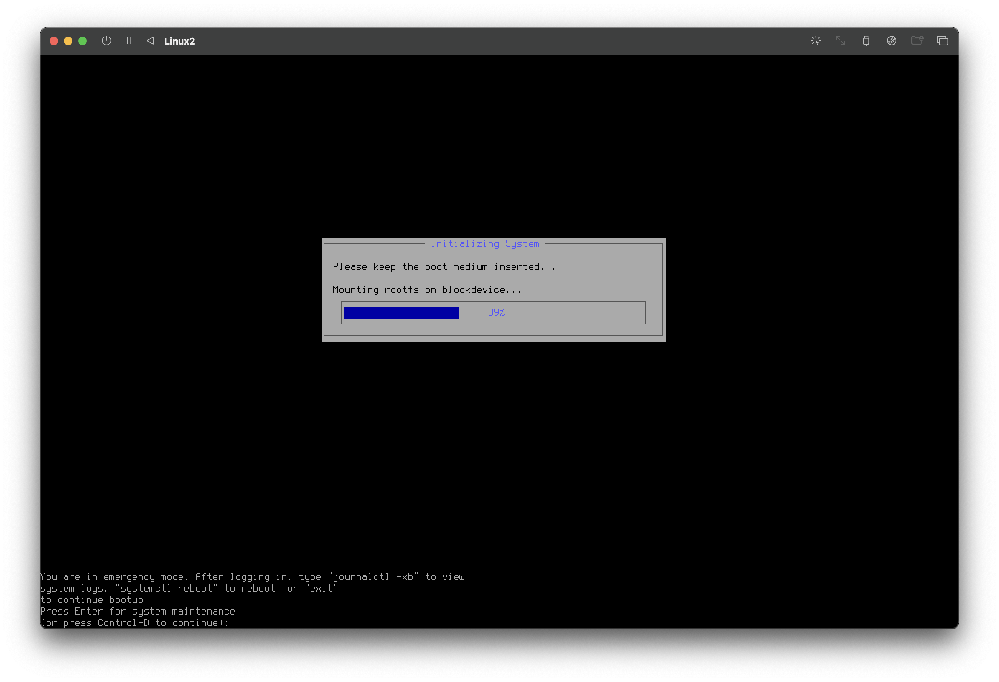
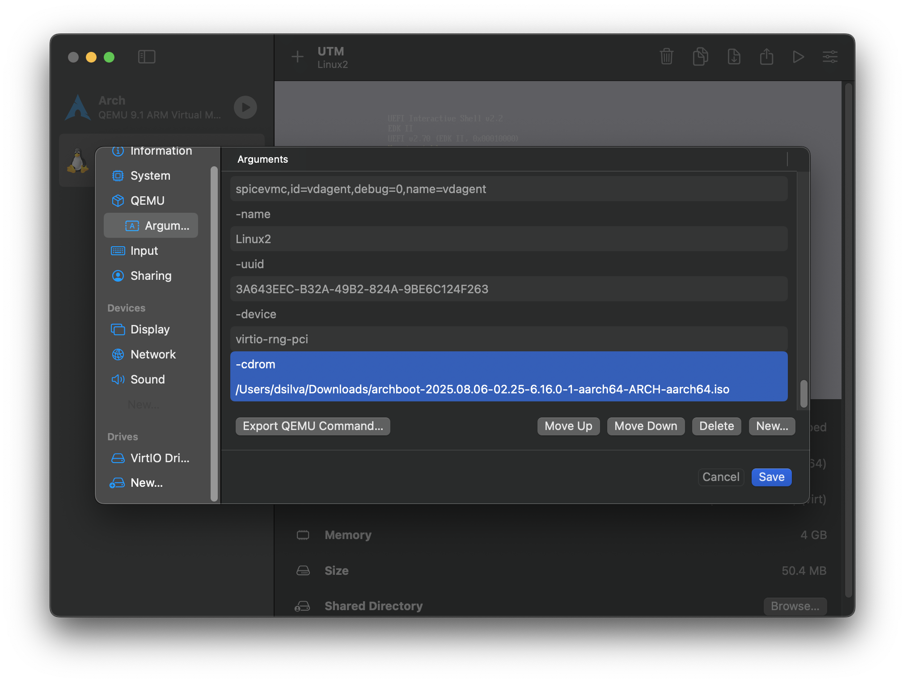
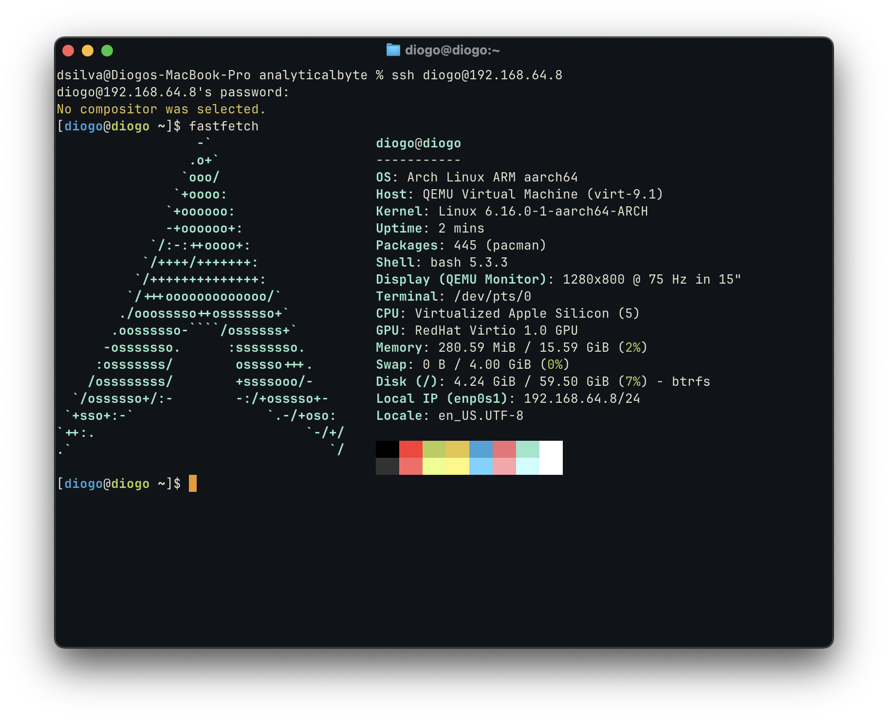
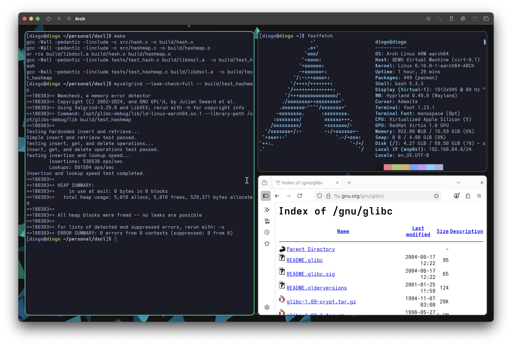

When I decided to set up an Linux environment for C development,
I wasn’t looking to abandon macOS entirely: believe it or not, I actually enjoy
working in Apple's ecosystem. But I wanted a clean Linux environment to create an
ideal C workflow without cluttering my main machine. Most  of all, I wanted to
use tools that were simply unavailable in MacOS, such as `valgrind`, and to use
`gcc` as my compiler without having to mess around with Xcode's default LLVM
compiler.

### Installing Arch
My first thought was to go native with [Asahi Linux](https://asahilinux.org),
since I had recently heard about the project and the idea of Linux directly on
Apple Silicon was tempting. Unfortunately, my particular chipset isn’t supported yet,
and waiting for official compatibility didn’t fit my timeline.

So, I turned to the reliable [UTM](https://mac.getutm.app), which is a light
GUI on top of QEMU that could give me a sandboxed Arch setup while keeping
macOS as my primary OS.

I chose to install Arch as my distro, mainly because it was lightweight, and
because I was most familiar with it. UTM is able to act as either a virtualizer,
or an emulator for other architecures such as x86, but for performance reasons
I opted for an `aarch64` installation. For the installer image,
I turned to [Archboot](https://archboot.com), which is supposedly compatible with:
> "aarch64, Apple Mac M1 and higher for virtual machines"

To my surprise, unfortunately the VM failed to boot, supposedly with a problem
to mount `rootfs`:



After spending a considerable time reading logs from `journalctl`, the issue
appeared to be a problem when initializing the emulated USB driver that contained
the installation medium. This meant that the ArchBoot GUI installer would crash,
leading me to the logged ISO. 

Though it was possible that I might be able to manually mount the 
necessary devices & configure Arch from the command line, I felt that this
would potentially lead to further problems and unwanted instability
during the installation. Reading through more logs, it appears that the issue was
related to the read-only setting of the USB device; however, we are unable to
change this from UTM.

I figured that the best solution would be to just change the device emulation type
to a CD Drive, as that emulated device would be very unlikely to fail, and was
naturally read-only. Unfortunately UTM does not seem to expose this option any more.
Thankfully, UTM is just a wrapper around QEMU, so we can just mess around with the 
command line arguments:

First, I changed the `USB Drive` interface from **USB** to **None (Advanced)** in
the UTM Settings, and then added the necessary QEMU flags:

`-cdrom [path to your ISO]`



Then, going into the BIOS of the VM lets us select the new PCIe device — in 
my case  _UEFI Misc Device 3_ and boot into GRUB. Finally, no more crashing! From here, installing Arch was a breeze, and setting
up SSH was also easy following the [OpenSSH guide](https://wiki.archlinux.org/title/OpenSSH).




It seemed like I had achieved the perfect setup — when idle, the QEMU proccess
used a mere 10% of my CPU, less than WindowServer (!!) — and I had convenient
access to a Linux environment.

### Getting valgrind to work
Even with Arch running smoothly, I hit another roadblock: `valgrind` wouldn’t work 
due to a lack of debug symbols:

```
Fatal error at startup: a function redirection
which is mandatory for this platform-tool combination
cannot be set up.  Details of the redirection are:

A must-be-redirected function
whose name matches the pattern:      strlen
in an object with soname matching:   ld-linux-aarch64.so.1
was not found whilst processing
symbols from the object with soname: ld-linux-aarch64.so.1
```


A suggested short-term fix was to install `glibc-debuginfo`, but this package is 
only available on Debian. On Arch, the closest alternative is the debuginfod
package. Unfortunately, even after installing it, the debug symbols couldn't be
retrieved—likely due to the aarch64 architecture, for which no prebuilt symbols 
appear to be available.

#### Building `glibc` from source
So, my only other alternative was to build `glibc` from source, maintaining 
the debug symbols. However, this is a delicate process because the GNU C Library
is a core component of your system. Installing it incorrectly can potentially 
break your entire Linux installation. For this reason, it's crucial to install
it into a custom directory, rather than overwriting the system `glibc`.

First, find your current version of `glibc`, and make sure that you download
the **same release** from the source. 

```
$ ldd --version # Find your current version of glibc
```

Next, download the source to that version, in my case, `glibc-2.41`. For a faster
download, a list of FTP mirrors that may be closer to you
on the [Free Software Foundation's website](https://www.gnu.org/prep/ftp.en.html):
```sh
$ wget http://ftp.gnu.org/gnu/libc/glibc-2.41.tar.gz
$ tar -xvf glibc-2.41.tar.gz
$ cd glibc-2.41
```

We want to compile the library with full debugging information so `valgrind`
can analyze programs properly. We include the following `CFLAGS` for debug support:
* `-g`, which includes debug symbols in the compiled binaries
* `-fvisibility=default`, which ensures that _all_ symbols exported are visible

```sh
$ mkdir build && cd build
$ ../configure --prefix=/usr CFLAGS="-g -O2 -fvisibility=default"
$ make -j$(nproc)
```

Once compilation is complete, create a **custom installation path** and install.
It is essential that you specify a `DESTDIR` location here, as to not mess up
your included `glibc`.
```sh
$ sudo mkdir /opt/glibc-debug
$ sudo make install DESTDIR=/opt/glibc-debug
```

With the full debug symbols available, it is now possible to successfully
run `valgrind` on the desired program paths, though by specifically including
the debug libraries built for `glibc`:

```
valgrind /opt/glibc-debug/lib/ld-linux-aarch64.so.1 --library-path /opt/glibc-debug/lib $PROGRAM_PATH
```

And, with that, we have `valgrind` fully running:

#### Convenience 
Unfortunately, remembering and typing out this full command is
not very easy. So, with the help of ✨ AI ✨, I created a small helper script
that wraps the long command and lets you run `valgrind` with your debug-enabled
`glibc`:

<script src="https://gist.github.com/diogoos/a99c352a1d634fb11277f79ab525dc70.js"></script>

Simple `chmod +x` and add the script to your `$PATH`, and you're good to go.

### Conclusions
In the end, the process reinforced just how much flexibility and control
Linux offers—even when running in a virtualized environment on macOS.
Working through compatibility quirks and toolchain limitations
was a little tedious, but left me with a much better understanding of the inner
workings of my machine.

It also highlighted the value of tailoring a development environment to fit your 
exact needs rather than compromising with “good enough.” The final setup may have
taken more effort than a pre-packaged solution, but the payoff is a workspace
that feels fast, capable, and entirely my own.

I also installed (and extensively troubleshooted) `hyprland`, because of, well,
the _hype_ around it, and will likely be sharing my thoughts about it in a future post!



